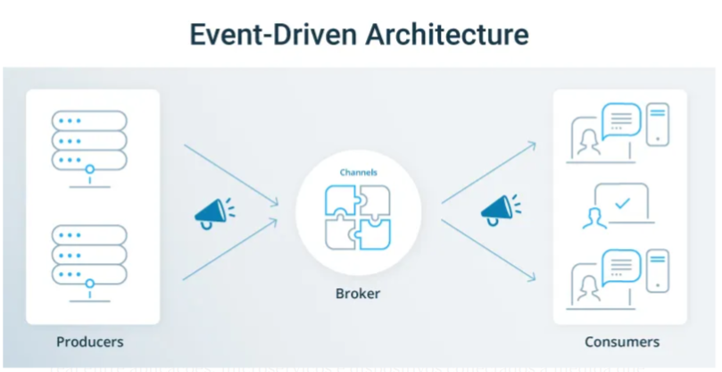
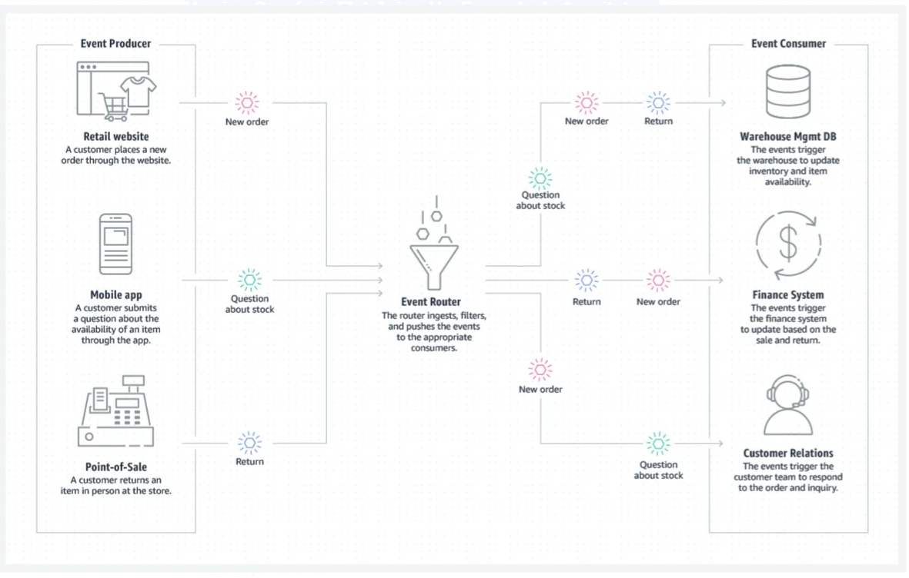

# Arquitetura Orientada a Eventos (EDA)

## Sumário
- [O que é?](#o-que-é)
- [Conceitos Fundamentais](#conceitos-fundamentais)
- [Por que usar?](#por-que-usar)
- [Vantagens](#vantagens)
- [Casos de Uso](#casos-de-uso)
- [Exemplos](#exemplos)
- [Conceitos Chave](#conceitos-chave)
- [Referências](#referências)

---

## O que é?

Arquitetura orientada a eventos é um padrão de design de software que permite que aplicações desacopladas publiquem e assinem eventos de forma assíncrona por meio de um corretor de eventos (middleware moderno orientado a mensagens).

É um método de desenvolvimento de sistemas de TI empresariais que permite que informações fluam em tempo real entre aplicações, microserviços e dispositivos conectados à medida que eventos ocorrem em toda a empresa.

### Desacoplamento
A arquitetura orientada a eventos permite um acoplamento frouxo de aplicações ao introduzir um intermediário conhecido como corretor de eventos. Isso significa que aplicativos e dispositivos não precisam saber para onde estão enviando informações ou de onde vem a informação que estão consumindo.

---

## Conceitos Fundamentais

### O que é um Evento?
Uma mudança de estado é chamada de evento. Em uma arquitetura orientada a eventos, tudo o que acontece dentro e para sua empresa é um evento:
- Solicitações de clientes
- Atualizações de estoque
- Leituras de sensores
- Mudanças de estado do sistema

---

## Por que usar?

O valor de conhecer um determinado evento e poder reagir a ele se degrada com o tempo. Quanto mais rápido você conseguir informações sobre eventos onde eles precisam estar, mais eficazmente sua empresa reagirá a oportunidades para:
- Agradar um cliente
- Mudar a produção
- Realocar recursos

### Vantagens sobre Abordagem Tradicional
A arquitetura orientada a eventos, que envia informações conforme os eventos acontecem, é uma abordagem arquitetônica melhor do que esperar que os sistemas consultem periodicamente atualizações (polling), como acontece com a abordagem liderada por API que a maioria das empresas adota hoje.

A arquitetura orientada a eventos garante que, quando um evento ocorre, as informações sobre ele sejam enviadas a todos os sistemas e pessoas que precisam.

---

## Vantagens

As principais vantagens da arquitetura orientada a eventos são:

### Capacidade de Resposta
- Melhor responsividade a mudanças em tempo real
- Reação imediata a eventos críticos

### Escalabilidade
- Adicione instâncias de serviço rapidamente sem considerar impactos downstream
- Distribuição eficiente de carga

### Agilidade nos Negócios
- Adicione rapidamente e facilmente novos serviços e análises
- Melhora significativa nos processos de negócios e experiência do cliente

### Operações Eficientes
- Tudo acontece o mais rápido possível, e nada espera por mais nada
- Roteamento e filtragem de tópicos dividem serviços rápida e facilmente
- Para adicionar outro serviço, simplesmente faça com que ele assine um evento - não há impacto nos serviços existentes

---

## Casos de Uso

Os benefícios da arquitetura orientada a eventos são especialmente relevantes em casos de uso onde uma única mudança pode ter consequências enormes, estendendo-se por toda a cadeia.

De acordo com uma pesquisa de 2021, os 4 principais casos de uso para arquitetura orientada a eventos são:

1. **Integração de aplicações**
2. **Compartilhamento e democratização de dados entre aplicações**
3. **Conectando dispositivos IoT para ingestão de dados e análises**
4. **Microsserviços que habilitam eventos**

---

## Exemplos

### Varejo e Comércio Eletrônico

O valor da arquitetura orientada a eventos transcende indústrias e pode ser aplicado tanto a pequenas empresas quanto a grandes corporações multinacionais.

Varejos e bancos podem usá-lo para:
- Agregar dados de sistemas de ponto de venda
- Distribuir entre redes de distribuição
- Executar promoções
- Otimizar estoques
- Oferecer excelente atendimento ao cliente

Note que nenhum sistema (estoque, financeiro ou suporte ao cliente) está fazendo polling para perguntar se há novos eventos; Eles são simplesmente filtrados e roteados em tempo real para os serviços e aplicações que registraram interesse.

---

## Conceitos comuns de arquitetura orientada a eventos que você deve conhecer

Existem oito conceitos arquitetônicos chave que precisam ser compreendidos para que a arquitetura orientada a eventos seja bem-sucedida:

### 1. Corretor de Eventos

Um Event Broker é um middleware (que pode ser software, appliance ou SaaS) que roteia eventos entre sistemas usando o padrão de mensagens publicar-assinar. Todos os aplicativos se conectam ao corretor de eventos, que é responsável por aceitar eventos dos remetentes e entregá-los a todos os sistemas assinados para recebê-los.

É necessário um bom design e governança do sistema para garantir que os eventos fiquem onde são necessários e comunicação eficaz entre quem envia eventos e quem precisa responder. É aí que ferramentas — como um portal de eventos — podem ajudar a capturar, comunicar, documentar e governar arquitetura orientada a eventos.

### 2. Portal de Eventos

À medida que as organizações buscam adotar uma arquitetura orientada a eventos, muitas estão tendo dificuldade para documentar o processo de design e entender os impactos das mudanças no sistema. Portais de eventos permitem que as pessoas projetem, criem, descubram, cataloguem, compartilhem, visualizem, protejam e gerenciem eventos e aplicativos orientados a eventos. Os portais de eventos atendem a três públicos principais:

- Arquitetos utilizam um portal de eventos para definir, discutir e revisar eventos, definições de dados e relacionamentos de aplicação.
- Desenvolvedores usam um portal de eventos para descobrir, entender e reutilizar eventos em diferentes aplicações, linhas de negócio e entre organizações externas.
- Cientistas de dados utilizam um portal de eventos para entender dados orientados a eventos e descobrir novos insights combinando eventos.

### 3. Tópicos

Os eventos são marcados com metadados que descrevem o evento, chamados de "tópico". Um tópico é uma sequência de texto hierárquica que descreve o que está no evento. Os publishers só precisam saber para qual tema enviar o evento, e o corretor de eventos cuida da entrega para os sistemas que precisam disso. Os usuários do aplicativo podem registrar seu interesse em eventos relacionados a um determinado tema assinando esse tema. Eles podem usar coringas para assinar um grupo de tópicos que tenham sequências de temas semelhantes. Usando a taxonomia de tópicos correta e as assinaturas, você pode cumprir duas regras da arquitetura orientada a eventos:

- Um assinante deve assinar apenas os eventos necessários. A assinatura deve fazer a filtragem, não a lógica de negócios.
- Um editor deve enviar um evento apenas uma vez, para um tema, e o corretor de eventos deve distribuí-lo para qualquer número de destinatários.

### 4. Malha de Eventos

Uma malha de eventos é criada e habilitada por meio de uma rede de corretores de eventos interconectados. É uma camada de infraestrutura configurável e dinâmica para distribuir eventos entre aplicações desacopladas, serviços em nuvem e dispositivos, roteando dinamicamente eventos para qualquer aplicação, não importa onde essas aplicações estejam implantadas no mundo, em qualquer nuvem, on-premises ou ambiente IoT. Tecnicamente falando, uma malha de eventos é uma rede de corretores de eventos interconectados que compartilham informações de assinatura de tópicos para consumidores e encaminham mensagens entre si para que possam ser repassadas aos assinantes.

### 5. Execução Diferida

Se você está acostumado com APIs baseadas em REST, o conceito de execução diferida pode ser difícil de compreender. A essência da arquitetura orientada a eventos é que, ao publicar um evento, não espera por uma resposta. O corretor de eventos "mantém" (persiste) o evento até que todos os consumidores interessados o aceitem ou recebam, o que pode ser algum tempo depois. Agir sobre o evento original pode então causar a emissão de outros eventos que são igualmente persistentes.

Assim, a arquitetura orientada a eventos leva a cascatas de eventos que são temporal e funcionalmente independentes uns dos outros, mas que ocorrem em sequência. Tudo o que sabemos é que o evento A em algum momento fará algo acontecer. A execução do evento A que consome a lógica não é necessariamente instantânea; sua execução é adiada.

### 6. Consistência Eventual

Seguindo essa ideia de execução adiada, onde você espera que algo aconteça depois, mas não espera por isso, está a ideia de consistência eventual. Como você não sabe quando um evento será consumido e não está esperando confirmação, não pode afirmar com certeza que um dado banco de dados já acompanhou totalmente tudo o que precisa acontecer e não sabe quando isso acontecerá. Se você tem múltiplas entidades com estado (banco de dados, MDM, ERP), não pode dizer que elas terão exatamente o mesmo estado; Você não pode assumir que eles são consistentes. No entanto, para um determinado objeto, sabemos que ele se tornará consistente eventualmente.

### 7. Coreografia

Execução adiada e consistência eventual nos levaram ao conceito de coreografia. Para coordenar uma sequência de ações tomadas por diferentes serviços, você pode optar por introduzir um serviço mestre dedicado a acompanhar todos os outros serviços e agir em caso de erro. Essa abordagem, chamada orquestração, oferece um único ponto de referência ao rastrear um problema, mas também um único ponto de falha e um gargalo.

Com a arquitetura orientada a eventos, os serviços são confiados para entender o que fazer com um evento recebido, frequentemente gerando novos eventos. Isso leva a uma "dança" de serviços individuais fazendo suas próprias coisas mas, quando combinados, produzindo uma resposta implicitamente coordenada, daí o termo coreografia.

### 8. CQRS: Segregação de Responsabilidades por Consulta de Comandos

Uma forma comum de escalar microserviços é separar o serviço responsável por fazer algo (um comando) do serviço responsável por responder consultas. Normalmente, você precisa responder a muito mais consultas do que para uma atualização ou inserção, então separar responsabilidades dessa forma facilita a escalabilidade do serviço de consulta.

Usar arquitetura orientada a eventos facilita isso, já que o tópico deve conter o verbo, então você simplesmente cria mais instâncias do serviço de consulta e ele escuta os tópicos com o verbo de consulta.

---

## Os 6 Princípios da Arquitetura Orientada por Eventos

Aqui estamos, alguns princípios principais da arquitetura orientada a eventos:

1. Use uma rede de corretores de eventos para garantir que as "coisas" certas recebam os eventos certos.
2. Use os tópicos para garantir que você envie apenas uma vez e receba apenas o que precisa.
3. Use um portal de eventos para projetar, documentar e governar arquitetura orientada a eventos entre equipes internas e externas.
4. Use persistência do corretor de eventos para permitir que os consumidores processem eventos quando estiverem prontos (execução diferida).
5. Lembre-se, isso significa que nem tudo está atualizado (eventual consistência).
6. Use tópicos novamente para separar diferentes partes de um serviço (consulta de comando, segregação de responsabilidades).

---

## Conclusão

Arquiteturas orientadas a eventos são uma forma de projetar sistemas que tornam suas aplicações mais flexíveis e capazes de crescer sem problemas em toda a sua empresa. Embora esse método possa trazer algumas novas dificuldades e complexidades, é uma boa forma de criar aplicações complicadas permitindo que diferentes grupos trabalhem por conta própria. Alguns serviços em nuvem até oferecem ferramentas gerenciadas que podem ajudar sua organização a construir esse tipo de arquitetura. Este guia explica muitos conceitos sobre arquiteturas orientadas a eventos, sugere algumas melhores práticas e menciona serviços úteis para ajudar sua equipe de desenvolvimento a criar essas arquiteturas. Lembre-se, escolher uma arquitetura orientada a eventos não é apenas sobre tecnologia. Para realmente obter os benefícios, você precisa mudar a forma como pensa sobre desenvolvimento e como sua equipe funciona. Os desenvolvedores precisarão de muita liberdade para escolher a tecnologia e o design certos para sua parte específica da aplicação.

---

## Referências

- https://medium.com/@seetharamugn/the-complete-guide-to-event-driven-architecture-b25226594227
